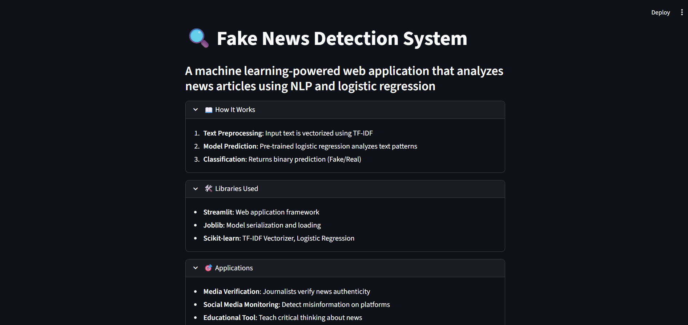

# Fake News Detection System

## Overview
A machine learning-powered web application that analyzes news articles and predicts whether they are fake or real using natural language processing and logistic regression.

## How It Works
1. **Text Preprocessing**: Input text is vectorized using TF-IDF (Term Frequency-Inverse Document Frequency)
2. **Model Prediction**: Pre-trained logistic regression model analyzes text patterns
3. **Classification**: Returns binary prediction (Fake/Real) with confidence
4. **Web Interface**: Streamlit provides user-friendly interface for real-time testing

## Libraries Used
- **Streamlit**: Web application framework
- **Joblib**: Model serialization and loading
- **Scikit-learn**: Machine learning algorithms (TF-IDF Vectorizer, Logistic Regression)
- **Pandas**: Data manipulation (training phase)
- **NumPy**: Numerical computations

## Files Structure
```
├── app.py              # Main Streamlit application
├── lr_model.jb         # Trained logistic regression model
├── vectorizer.jb       # TF-IDF vectorizer
├── Fake.csv           # Fake news training data
├── True.csv           # Real news training data
├── requirements.txt    # Python dependencies
└── README.md          # Project documentation
```

## Installation & Usage
```bash
pip install streamlit joblib scikit-learn pandas numpy
python -m streamlit run app.py
```

## Website Interface

### Main Interface

*The main landing page showing project overview, expandable sections, and testing interface*

### Testing Results

*Example of fake/real news detection results with sample articles*

## Applications
- **Media Verification**: Journalists can verify news authenticity
- **Social Media Monitoring**: Detect misinformation on platforms
- **Educational Tool**: Teach critical thinking about news consumption
- **Content Moderation**: Automated fake news filtering
- **Research**: Study misinformation patterns and trends
- **Fact-Checking**: Support fact-checkers with preliminary analysis

## Model Performance
The system uses logistic regression trained on labeled news datasets to achieve reliable fake news detection through text pattern analysis.
